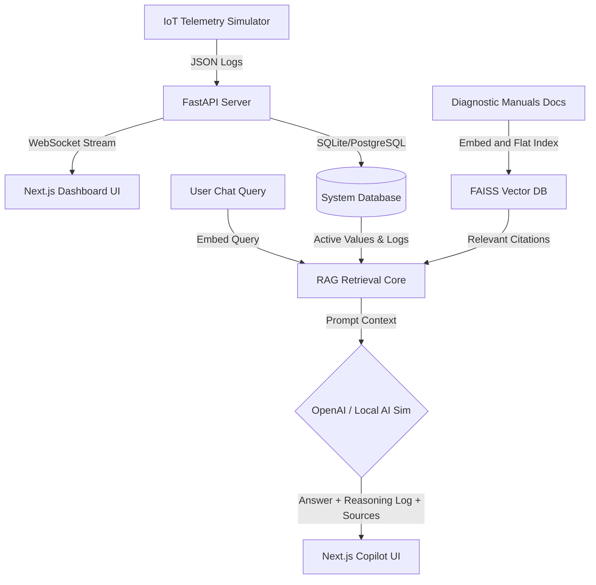

# JKUAD VinRaVS 2502 — AI Research Copilot for Smart IoT Systems
### Powered by VinRaVS Intelligence Engine

https://jahnavi-mogarala.github.io/AI-Research-copilot-for-smart-IOT-systems-/


JKUAD VinRaVS 2502 is a premium, enterprise-grade AI Research Platform and IoT Anomaly Engine designed with luxury Silicon Valley design standards. It leverages a Next.js 15 frontend styled in dark matte crimson and a high-performance FastAPI backend.

The platform provides live telemetry monitoring, autonomous AI diagnostics, and a cited RAG question-answering search engine using FAISS indexing.

---

## Core Features
1. **Premium Analytics Telemetry Dashboard**: Real-time websocket-driven chart grids illustrating Temperature, Humidity, Pressure, Gas levels, Power consumption, and UPS Battery health.
2. **AI Research Copilot (RAG)**: Chat interface that queries real-time sensors, history logs, and manual guidelines with full text-citations and step-by-step cognitive reasoning dropdowns.
3. **Autonomous Diagnostic Agent**: Constantly monitors telemetry trends, generates predictive maintenance reports, and triggers active alerts.
4. **Security Center**: Dual-factor authentication with custom OTP validation (override codes `123456` or `2502`).
5. **System Configurator**: Admin controls for adjusting user roles and scanning bounds.

---


https://github.com/user-attachments/assets/22fa102c-b6e5-46fe-bfcc-c7219487316e


##  Architecture Flow Diagram



---

##  Setup Instructions

### Option A: Quickstart via Docker Compose (Recommended)
Make sure you have Docker and Docker Compose installed.

1. **Clone and navigate to the project directory**:
   ```bash
   cd "AI Research copilot for smart iot systems"
   ```
2. **Start all services**:
   ```bash
   docker-compose up --build
   ```
3. **Access the application**:
   - Web Interface: `http://localhost:3000`
   - Backend API Docs: `http://localhost:8000/docs`

---

### Option B: Local Manual Installation (No Docker)

#### 1. Backend Setup
1. Navigate to the `backend` folder:
   ```bash
   cd backend
   ```
2. Create and activate a python virtual environment:
   ```bash
   python -m venv venv
   # On Windows:
   venv\Scripts\activate
   ```
3. Install dependencies:
   ```bash
   pip install -r requirements.txt
   ```
4. Run the development server:
   ```bash
   uvicorn main:app --reload --host 0.0.0.0 --port 8000
   ```

#### 2. Frontend Setup
1. Open a new terminal and navigate to the `frontend` folder:
   ```bash
   cd frontend
   ```
2. Install npm packages:
   ```bash
   npm install --legacy-peer-deps
   ```
3. Launch Next.js dev server:
   ```bash
   npm run dev
   ```
4. Visit `http://localhost:3000` in your browser.

---

##  Default Credentials & Access Keys
- **Default OTP Code**: `123456` or `2502`
- **Default Developer / Researcher Account**: Register any email; it will request the OTP. Once registered, log in using the credentials and enter `123456` on the OTP page.
- **Access Roles**:
  - `Student`: Read-only telemetry access.
  - `Researcher`: RAG access and analytics charts.
  - `Admin`: User directories, roles cycle, and system parameters override.

